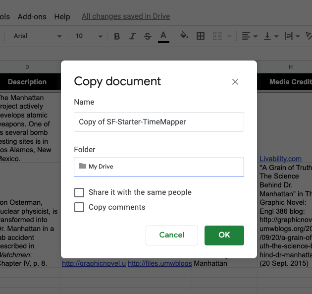
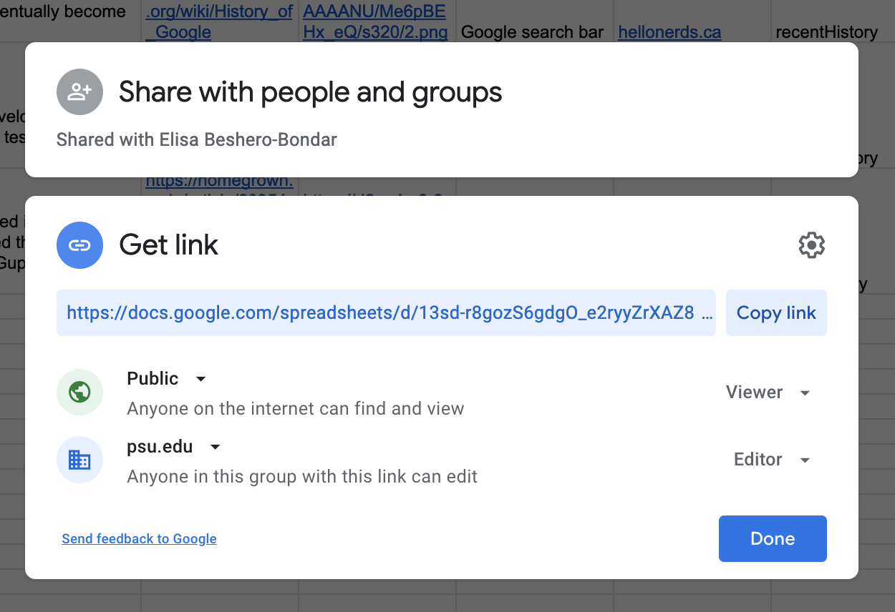
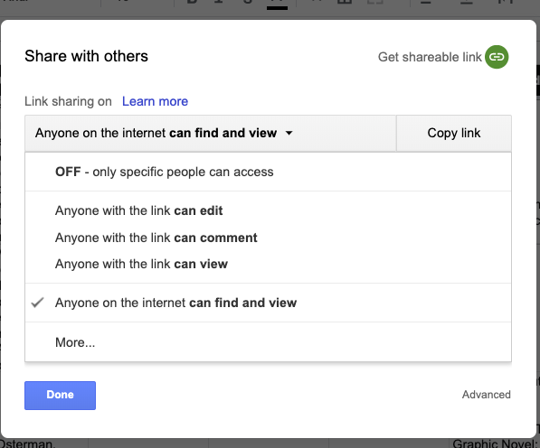

# Instructions for Building a TimeMap 

First, prepare/access your Google Drive: 

1. You will need a Google account to be able to work with Google Drive. [Create a Google account](https://edu.gcfglobal.org/en/googledriveanddocs/getting-started-with-google-drive/print/) if you don’t have one already. If you have a Google account, be sure you can log in to it and access Google Drive. 
1. Create a folder for this class in your Google Drive: perhaps named "DIGIT-100", "introDH", or something convenient for you to quickly locate files you are working on. Make sure you know how to find your folder reliably. 

Now, you need a Google Sheet to start from, as well as Google Sheet template to consult:

Your Starter Google sheet:
1. I have created a starter Google Sheet for you to build on with this assignment. Open [my starter file](https://docs.google.com/spreadsheets/d/13sd-r8gozS6gdgO_e2ryyZrXAZ82437UTFEMcRe5594/edit?usp=sharing).
1. On my starter file, go to File > Make a copy. You’ll open a window like this: 

1. From that window, click on the Folder “My Drive” and find the arrow that lets you navigate to file directories you have created in your Google Drive. Find the folder you made for our class, and click “OK”. (Don't worry about sharing or copying comments; you can leave those boxes unchecked.)
1. Now, find your way to your Google Drive, and your folder, and open the Google Sheet you just copied to your space.
1. On your Google Sheet, click on **File > Publish to the Web**. NOTE: IGNORE AND DO NOT COPY THE LINK YOU SEE ON THE "PUBLISH TO THE WEB" SCREEN. IT IS NOT HELPFUL FOR TIMEMAPPER. THE LINK YOU WANT IS IN THE NEXT STEP!
1. Find and click the green button labeled “Share” in the upper right corner of the Google Sheet. It is most likely set to “OFF - only specific people can access.” Click the down arrow next to the share setting to see your choices, and select “Anyone on the internet **can find and view**”. 
    * If you're using your *Penn State account with Google*, your screen should look like this: 
     
    * If you're using a Google account *external to Penn State*, your screen should look like this: 

1. Use the green Share Button to retrieve the link for sharing with me and with TimeMapper.
1. To learn what the various fields are for in this sheet, consult this [helpful sheet from TimeMapper](https://docs.google.com/spreadsheets/d/1LlYBnfhvD3ZUXMGZ8e52UwYp-xn_NeWmaGBx7VBz5V8/edit?usp=sharing) with explanations of the column headings and the geo-mapping formula.

Now you are ready to share your Google Sheet with TimeMapper to build a web visualization. 
1. Visit [the TimeMapper site to fill out the web form](http://timemapper.okfnlabs.org/create). 
1. Use the green Share Button to retrieve the link for the Data Source. 
1. Please provide a title that includes your name. (This helps me to keep track of each of you when I have a million tabs open.)
1. You’ll see a prompt for creating an account with TimeMapper. Do this if you wish, or you may choose to remain anonymous. 
1. In Type of Data View, select **Timemap**.
1. Leave the default settings for the last two options, and click the “Publish” button at the bottom. 

My starter TimeMapper for our class is available from this link: [https://timemapper.okfnlabs.org/epyllia/sf-starter-timemapper](https://timemapper.okfnlabs.org/epyllia/sf-starter-timemapper).
Your link is probably longer and full of gibberish if you remained anonymous. That is okay. You may find that you want a shorter custom link, and for that I recommend [bit.ly](https://bit.ly) or another custom link-shortener that you know and love. You can create a custom link with your name in it if you wish. 

#### How to record your TimeMap with our class:
Log in to [Canvas](https://canvas.psu.edu) and find the assignment to submit your two TimeMapper URLs:
1. Your Google Sheet (the link from the green Share button)
1. Your TimeMapper visualization

